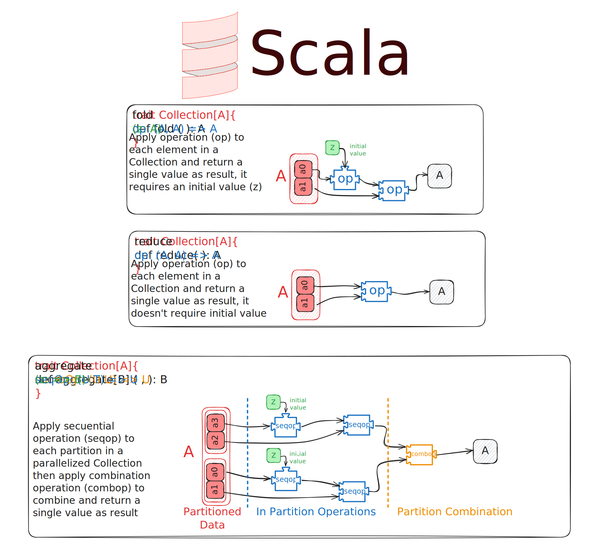

# Scala Learning Notes

## Table of Contents

- [Scala Learning Notes](#scala-learning-notes)
  - [Table of Contents](#table-of-contents)
  - [About ](#about-)
  - [Repository Content ](#repository-content-)
  - [Learning Notes](#learning-notes)
  - [Repository Structure](#repository-structure)
  - [Requirements](#requirements)
  - [How to Contribute](#how-to-contribute)
  - [Additional Resources](#additional-resources)
  - [License](#license)

## About 

This repository is dedicated to my practice and notes as I learn **Scala** by following some **Coursera** and other courses. Here, I will store the code for the course projects as well as my learning notes.

## Repository Content 

1. **Learning Notes**  
   - I have created an **Excalidraw** file with my visual notes and summaries of the concepts learned throughout the course.
   - The notes file is located in the `notes/` folder.

2. **Course Projects**  
   - Throughout the course, I will complete various projects, which I will download and upload here.
   - The projects will be organized into separate folders within the repository.

## Learning Notes

As part of my learning process, I've made visual notes using Excalidraw. You can view an image of the notes below:

For more detailed notes, check out the Excalidraw file [here](notes/notes.excalidraw).

## Repository Structure

📦Scala Learning

 ┣ 📂notes

 ┃ ┗ [📜notes.excalidraw](notes/notes.excalidraw)

 ┣ 📂scala-project-1 ..

 ┣ 📂scala-project-2 ..

 ┣ 📂scala-project-3 ..

 ┗ [📜README.md](README.md)
 

These instructions will get you a copy of the project up and running on your local machine for development and testing purposes. See [deployment](#deployment) for notes on how to deploy the project on a live system.

## Requirements

To run the projects, make sure you have the following installed:

- [Scala](https://www.scala-lang.org/download/)
- [sbt (Scala Build Tool)](https://www.scala-sbt.org/download.html)
- [Metals - Visual Studio Code](https://scalameta.org/metals/docs/editors/vscode/)

## How to Contribute

This repository is primarily for educational purposes. However, if you have suggestions or improvements, feel free to open an **issue** or a **pull request**.

## Additional Resources

- [Functional Programming Principles in Scala](https://www.coursera.org/learn/scala-functional-programming/)
- [Functional Program Design in Scala](https://www.coursera.org/learn/scala-functional-program-design)
- [Parallel programming](https://www.coursera.org/learn/scala-parallel-programming/home/week/1)
- [Official Scala Documentation](https://docs.scala-lang.org/)

## License

This project is licensed under the MIT License - see the [LICENSE](LICENSE) file for details.

---

I hope you find this repository useful and enjoy learning Scala!
